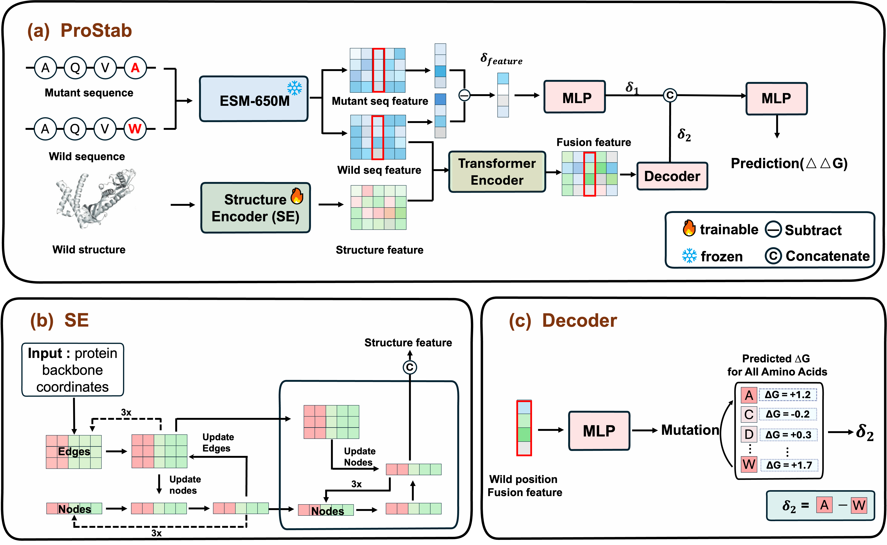

# ProStab: Prediction of protein stability change upon mutations by inverse folding and protein language models


[](https://www.biorxiv.org/content/10.1101/2025.08.11.669595v1)
[](https://github.com/facebookresearch/hydra)

## News

⭐ **Protein stability prediction for multiple mutations and indels (insert and delete) is now available: [UniStab](https://github.com/xlab-BioAI/UniStab).** ⭐

## Acknowledgements
We sincerely thank the SPURS team for open-sourcing their code and data to the community, and we are grateful to the SPURS team for providing invaluable constructive feedback and guidance throughout this work.

ProStab project builds heavily off of [SPURS](https://github.com/luo-group/SPURS/tree/main), and the training pipeline, test pipeline,
dataset, configs, baselines, and metrics implementation were adapted from SPURS


## Overview

ProStab, a deep learning framework that integrates sequence-derived and structure-informed features for accurate prediction of ∆∆G for protein point mutations given an initial structure. ProStab combines representations from a protein language model applied to both wild-type and mutant sequences, and from the inverse folding model ProteinMPNN applied to the wild-type structure. It jointly models two sources of information: mutation-specific effects, captured as embedding differences at the substitution site between wild-type and mutant sequences; and site-specific priors, derived from the wild-type sequence and structure, which reflect the local context and substitutional tolerance.




## Web server
[ProStab web server](https://ails.sjtu.edu.cn/prostab/)

⭐ **Ongoing updates will keep making this web server easier and more convenient to use.** ⭐

⭐ **If you find ProStab useful, please star this repository!** ⭐

⭐ **We encourage users of our web server to cite both ProStab and SPURS in recognition of the foundational framework and valuable collaborative insights provided by the SPURS team** ⭐

## Installation

```bash
git clone https://github.com/xtanh/ProStab.git
cd ProStab
# Add installation steps if needed
```

## Requirements

```bash
conda env create -f environment.yml
conda activate ProStab
```

## Downloading weights and data

1. Download pre-trained weights from: [https://drive.google.com/file/d/1xZOG3wkn6UGJS_j533laRbZLWV5DU13T/view?usp=share_link]
2. Extract and place in `model_weight/checkpoints/`

```bash
mkdir -p model_weight/checkpoints
# Place downloaded best.ckpt in model_weight/checkpoints/
```

**ProteinMPNN Weights**
1. Download ProteinMPNN weights: `v_48_020.pt` from [ProteinMPNN GitHub](https://github.com/dauparas/ProteinMPNN)
2. Create the directory and place the file:
```bash
mkdir -p ./data/checkpoints/ThermoMPNN/vanilla_model_weights
# Place v_48_020.pt in ./data/checkpoints/ThermoMPNN/vanilla_model_weights/
```

### Testing

```bash
python test.py experiment_path=model_weight  datamodule._target_=megascale data_split=test ckpt_path=model_weight/checkpoints/best.ckpt  mode=predict
```


### Training

```bash
python train.py 
```

### Inference

```bash
from prostab.inference import  parse_pdb, get_prostab
model, cfg = get_prostab('./model_weight')
pdb_name = 'example'
pdb_path = '/home/xy_th/PROSTAB/data/inference_example/1A0N.pdb'
chain = 'A'
mutation = "V1A"  
pdb_mut = parse_pdb(pdb_path, pdb_name, chain, cfg, mutation=mutation)
result_mutant = model(pdb_mut, return_logist=True)
print(f"mutation {mutation} score: {result_mutant.item()}")
```

## Data

Required data files (not included in repository):
<!-- - `data/dataset/megascale/Tsuboyama2023_Dataset2_Dataset3_20230416.csv`
- `data/dataset/Domainome/Supplementary_Table_5_aPCA_vs_variant_effect_predictors.csv`
- `data/dataset/geostab_data/dms/dms.csv` -->


## 📄 License

This project builds heavily upon **SPURS**. Please refer to their [original license](https://github.com/luo-group/SPURS) for more details.

##  Acknowledgments

We gratefully acknowledge the following projects and contributions that made ProStab possible:

### Foundation Framework
**Important Note**: This project is significantly based on the **SPURS** framework. We gratefully acknowledge that:

- **Benchmark Datasets**: All evaluation datasets originate from SPURS
- **Training Strategy**: Our training methodology follows SPURS protocols  
- **Evaluation Framework**: Assessment metrics and procedures are consistent with SPURS
- **Code Foundation**: The training and evaluation framework is built upon SPURS

We sincerely thank the SPURS team for providing an extensible training, evaluation, and modeling framework that enabled this research.

### Key Components
- **SPURS**: Foundational framework from [Luo Group](https://github.com/luo-group/SPURS/tree/main)
- **ProMEP**: Transformer encoder fuse strutural information and sequence information [Cheng et al](https://github.com/wenjiegroup/ProMEP)
- **ESM**: Protein language models from [Meta AI](https://github.com/facebookresearch/esm)
- **ProteinMPNN**: Inverse folding model from [Dauparas et al.](https://github.com/dauparas/ProteinMPNN)

## 📚 Citation

If you use ProStab in your research, please cite our work and the foundational papers:

```bibtex
@article{prostab2025,
  title={ProStab: Prediction of protein stability change upon mutations by inverse folding and protein language models},
  author={Tan, Hong and Wei, Xiaowei and Lin, Shenggeng and Mao, Xueying and Chen, Junwei and Sun, Heqi and Zhang, Yufang and Zhou, Zhenghong and Wei, Dong-Qing and Lin, Shuangjun and Xiong, Yi},
  journal={bioRxiv},
  year={2025},
  doi={10.1101/2025.08.11.669595},
  url={https://doi.org/10.1101/2025.08.11.669595}
}

@article{li2025generalizable,
  title={Generalizable and scalable protein stability prediction with rewired protein generative models},
  author={Li, Ziang and Luo, Yunan},
  journal={Nature Communications},
  year={2025},
  publisher={Nature Publishing Group UK London}
}

@article{thermompnn2024,
  title={Transfer learning to leverage larger datasets for improved prediction of protein stability changes},
  author={Dieckhaus, Henry and Brocidiacono, Michael and Randolph, Nicholas Z. and Kuhlman, Brian},
  journal={Proceedings of the National Academy of Sciences},
  volume={121},
  number={6},
  pages={e2314853121},
  year={2024},
  doi={10.1073/pnas.2314853121},
  url={https://www.pnas.org/doi/abs/10.1073/pnas.2314853121}
}
```

## Reference
Our work is based on the following papers.

```bibtex


@article{li2025generalizable,
  title={Generalizable and scalable protein stability prediction with rewired protein generative models},
  author={Li, Ziang and Luo, Yunan},
  journal={Nature Communications},
  year={2025},
  publisher={Nature Publishing Group UK London}
}

@article{thermompnn2024,
  title={Transfer learning to leverage larger datasets for improved prediction of protein stability changes},
  author={Dieckhaus, Henry and Brocidiacono, Michael and Randolph, Nicholas Z. and Kuhlman, Brian},
  journal={Proceedings of the National Academy of Sciences},
  volume={121},
  number={6},
  pages={e2314853121},
  year={2024},
  doi={10.1073/pnas.2314853121},
  url={https://www.pnas.org/doi/abs/10.1073/pnas.2314853121}
}


@article{cheng2024zero,
  title={Zero-shot prediction of mutation effects with multimodal deep representation learning guides protein engineering},
  author={Cheng, Peng and Mao, Cong and Tang, Jin and Yang, Sen and Cheng, Yu and Wang, Wuke and Gu, Qiuxi and Han, Wei and Chen, Hao and Li, Sihan and others},
  journal={Cell Research},
  volume={34},
  number={9},
  pages={630--647},
  year={2024},
  publisher={Springer Nature Singapore Singapore}
}


@article{rives2021biological,
  title={Biological structure and function emerge from scaling unsupervised learning to 250 million protein sequences},
  author={Rives, Alexander and Meier, Joshua and Sercu, Tom and Goyal, Siddharth and Lin, Zeming and Liu, Jason and Guo, Demi and Ott, Myle and Zitnick, C Lawrence and Ma, Jerry and others},
  journal={Proceedings of the National Academy of Sciences},
  volume={118},
  number={15},
  pages={e2016239118},
  year={2021},
  publisher={National Acad Sciences},
  note={bioRxiv 10.1101/622803},
  doi={10.1073/pnas.2016239118},
  url={https://www.pnas.org/doi/full/10.1073/pnas.2016239118},
}

@inproceedings{zheng2023lm_design,
    title={Structure-informed Language Models Are Protein Designers},
    author={Zheng, Zaixiang and Deng, Yifan and Xue, Dongyu and Zhou, Yi and YE, Fei and Gu, Quanquan},
    booktitle={International Conference on Machine Learning},
    year={2023}
}

@article{dauparas2022robust,
  title={Robust deep learning--based protein sequence design using ProteinMPNN},
  author={Dauparas, Justas and Anishchenko, Ivan and Bennett, Nathaniel and Bai, Hua and Ragotte, Robert J and Milles, Lukas F and Wicky, Basile IM and Courbet, Alexis and de Haas, Rob J and Bethel, Neville and others},
  journal={Science},
  volume={378},
  number={6615},  
  pages={49--56},
  year={2022},
  publisher={American Association for the Advancement of Science}
}
```


---


